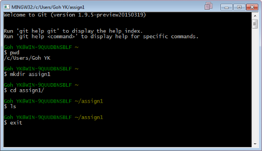

UECM3033 Numerical Methods (Assignment #1)
========================================================
--------------------------------------------------------

DEADLINES:

 - This assignment will contribute to 5 marks of the coursework.
 - Assignment submission: 29/1/2015 (Friday) by 12:00 noon.
 - Peer Reviews: 5/2/2015 (Friday) by 12:00 noon.

**All deadlines are final and no extensions are allowed.** Delay in submission of the assigments will delays the peer review process. Thus a penalty of 1 mark per day will be imposed for one day late in submission of assignment. Each student will need to review two peers. No mark will be awarded if a student failed to review the two peers.

---------------------------------------------------------
There are a total of 3 tasks for this assignments:

- setup a github repository
- setup Python
- modify and run a given Python script.

## Task 1 -- setup a github repository

Version control is a system that tracks changes of files and source codes so that you could recover or recall a specific version in the future. It is especially important if sharing and editing files across a team.

Git is a popular opensource version control system that is widely used by developers. Many of opensource software is managed by git version control. ([Git at Wikipedia.](https://en.wikipedia.org/?title=Git_(software)))

One of the useful features of git is that all files could be stored in the local repositories in your computer. Git is a command line based software, and thus there will be a bit of learning curve to overcome. On the other hand the installation of git is straight forward. Just point your browser to [http://git-scm.com/download/](http://git-scm.com/download/) and  download Git Bash for your operating system. Depending on your operating system, the procedure to install git will be a bit different, please consult the documentation. (If you are using Linux, usually git is already installed.)

The following is a screen shot of Git Bash session. Several basic folder navigation commands are as below: 



* *pwd* - print current working directory.
* *mkdir* - make directory
* *cd* - change directory
* *ls* - list the content of current directory
* *exit* - exit Git Bash

To begin using git we navigate into the folder we would like to use as local repository, say *assign1*. Then, we can initialize the repository by
```sh
$ git init
```
Once the repository is created, user could create or modify files in the repository. When a certain milestone is reach and the user decide all the changes made should be updated in the repository, then the user should *commit* the changes in the repository. Each commit to git repository will be tagged with the username of the person who made the commit and a commit message that give an indication of what were changed. Hence, we will need to configure git first before we can make any commit.
```
$ git config --global user.name "Your Name Here"
$ git config --global user.email "your_email@1utar.edu.my"
```
You will only need to do this once in your computer. Of course you could reconfigure git again when you wish to change your details. You can also check the configuration for git by the following command:
```
$ git config --list
```

It won't be too useful If git is only to store files locally. Usually we would like sync the local repositories with the cloud based git server for backup or sharing purposes. GitHub is a web-based hosting service that provide git version control. User is allowed to "*push*" or "*pull*" their local repositories to and from remote repositories.

First thing first, let sign up a GitHub account. 
- Go to GitHub homepage [https://github.com/join](https://github.com/join). 
- Enter a username, email and password and click "Sign up for GitHub".
- On the next screen, select the free plan and click "Finish Sign Up".

To complete **Task 1**:
* Login to your GitHub.
* While still stay logged in GitHub, go to [https://github.com/yongkheng/UECM3033_assign1](https://github.com/yongkheng/UECM3033_assign1)
* Click "fork" button at the top right hand corner. Now your GitHub will have a copy of the UECM3033_assign1 repository. Copy the URL.
* Go to the google form [http://goo.gl/forms/AqRxStO81O](http://goo.gl/forms/AqRxStO81O).
* Fill in your name, ID and the URL to your newly forked repository.
* Answer the question in the google form and submit.


------------------------------------------------------------

## Task 2 -- setup python

This part of the assignment consists of two parts:

1. Install and take a screen capture of your Python.
2. Save your screen shot onto GitHub repository.

For the installation of Python, you are encouraged to download and install Anaconda, a completely free Python distribution from Continuum Analytic. 

1. Go to [http://continuum.io/downloads](http://continuum.io/downloads)
2. Choose "I want Python 3.4".
3. Choose the right OS platform and install.
4. Start Spyder, the IDE (Integrated Development Environment) of Anaconda distribution of Python.
5. At the Python shell, type the following command and take a screen capture of the entire Spyder IDE, and call it "python.png"

```{}
import sys
sys.version
import this
```

If you prefer other distribution of Python other than Anacoda, you could also take a screen capture of the Python of your choice with the 3 lines of code above. However, the version of the Python used, must be 3.1 and above.

Next is to merge your file "python.png" with your GitHub repository.

#### 1. Clone the repository
```
$ git clone https://github.com/your_github_id/UECM3033_assign1
```
This will create a *UECM3033_assign1* folder. (Remember you can check your current directory with *pwd* and *ls*.) Change into the *UECM3033_assign1* folder.

#### 2. Copy "python.png" into *UECM3033_assign1* folder.

#### 3. Commit changes and push to GitHub.
```
$ git add -A
$ git commit -m "Added python.png"
$ git push
```

#### 4. Verify at GitHub website that "python.png" is added into the repo.

------------------------------------------------------------

## Task 3 -- modify and run a given Python script

In the repository that you just cloned, there is a "plot_rnd.py" file. Open the file, edit the following two lines by keyin your student id as the seed of the random number generator. 
```
np.random.seed(1234)
...
plt.savefig('foo.png')
```
2. Run the python script.
3. Save the resulting picture as "plot_rnd.png".
4. Upload into GitHub together with your modified python script

Thee resulting figure is something similar to the following:


------------------------------------------------------------

## Summary:

### Task 1:
* install Git Bash
* create GitHub account
* fork UECM3033_assign1 repository
* submit URL of forked repository

### Task 2:
* install Python, capture screen shot
* clone UECM3033_assign1 repository
* pull repository
* submit screen shot "python.png" to GitHub

### Task 3:
* Edit and run "plot_rnd.py"
* Submit "plot_rnd.py" and "plot_rnd.png" to GitHub.

One you have submitted your assignment, you may go to [http://goo.gl/forms/of9f5ZzarA](http://goo.gl/forms/of9f5ZzarA) to do your peer review starting 29/6/2015 (Monday) after 12:00 noon.
=======
# UECM3033_assign1
UECM3033 Numerical Methods Assignment 1
>>>>>>> f4f59c142d8efa796c89cdb6e70fbcbb6b65565d
