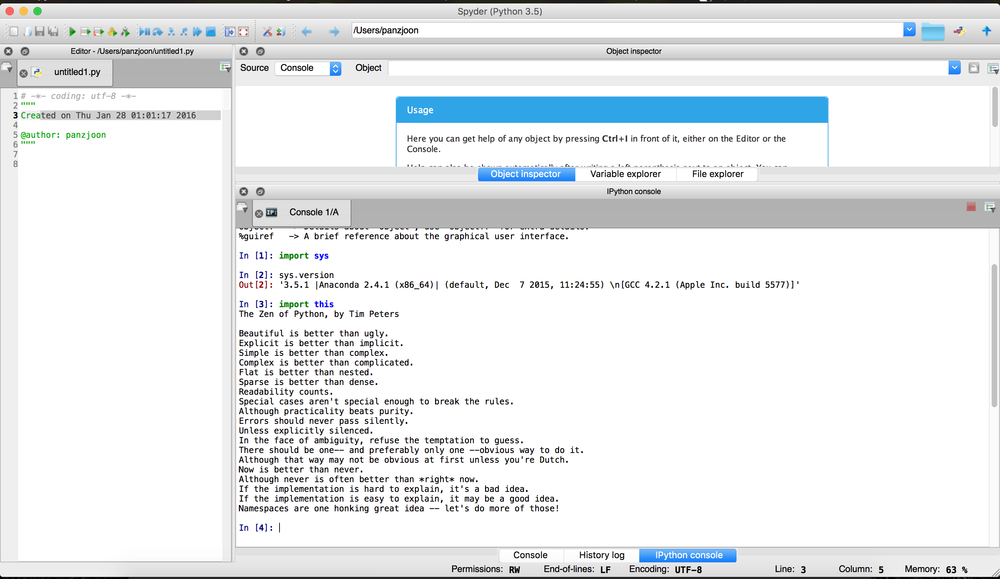

========================================================

- Prepared by: ** Pan Zi Joon **
- Tutorial Group: T2

--------------------------------------------------------

## Task 1 -- setup a github repository

The reports, codes and supporting documents are uploaded to Github at: 

[https://github.com/zjpan/UECM3033_assign1](https://github.com/zjpan/UECM3033_assign1)

---------------------------------------------------------

## Task 2 -- setup python

Put here the screen shot of file (python.png)

------------------------------------------------------------

## Task 3 -- modify and run Python script

In this section, please report:

1. The hexadecimal value of your student ID.

	The hexadecimal value of my student ID, 1308201, is 0x13f629.

2. Write down the definite integrals that you have chosen.

	Please refer to below for the definite integrals and the solution generated through numpy library:
    
    $$\int_0^{\infty} cos{x} * e^{-x^2} dx =\frac{\sqrt{\pi}\times e^{-1/4}}{2}.$$

3. Write down your system of 10 linear equations.

	\begin{align*}
3 x_0 +1 x_1 +3 x_2 +5 x_3 +6 x_4 +3 x_5 +8 x_6 +1 x_7 +9 x_8 +1 x_9  &= 5,\\
1 x_0 +2 x_1 +5 x_2 +7 x_3 +1 x_4 +5 x_5 +7 x_6 +1 x_7 +6 x_8 +3 x_9  &= 6,\\
6 x_0 +7 x_1 +2 x_2 +1 x_3 +5 x_4 +7 x_5 +9 x_6 +1 x_7 +8 x_8 +9 x_9  &= 8,\\
8 x_0 +5 x_1 +7 x_2 +9 x_3 +5 x_4 +3 x_5 +5 x_6 +7 x_7 +9 x_8 +1 x_9  &= 2,\\
1 x_0 +5 x_1 +7 x_2 +9 x_3 +3 x_4 +7 x_5 +9 x_6 +2 x_7 +5 x_8 +6 x_9  &= 5,\\
7 x_0 +8 x_1 +4 x_2 +2 x_3 +1 x_4 +5 x_5 +7 x_6 +9 x_7 +4 x_8 +1 x_9  &= 6,\\
9 x_0 +5 x_1 +4 x_2 +1 x_3 +3 x_4 +5 x_5 +7 x_6 +8 x_7 +1 x_8 +2 x_9  &= 8,\\
5 x_0 +7 x_1 +8 x_2 +9 x_3 +5 x_4 +3 x_5 +1 x_6 +5 x_7 +6 x_8 +7 x_9  &= 3,\\
1 x_0 +5 x_1 +7 x_2 +9 x_3 +3 x_4 +4 x_5 +5 x_6 +6 x_7 +1 x_8 +6 x_9  &= 1,\\
5 x_0 +6 x_1 +7 x_2 +8 x_3 +9 x_4 +6 x_5 +5 x_6 +4 x_7 +5 x_8 +6 x_9  &= 3
\end{align*}

	The solution generated through numpy library is shown below:

	\begin{align*}
&x_0 = -0.73336704,\ x_1 = -1.46564359,\ x_2 = 3.57614988,\\
&x_3 = -2.94546893,\ x_4 = -0.17020436,\ x_5 = 0.64780361,\\  
&x_6 = 0.05205152,\ x_7 =0.66543932, \ x_8 = 1.1275351,\\  
&x_9= 0.5127877
\end{align*}

-----------------------------------

last modified: 28 January 2016

